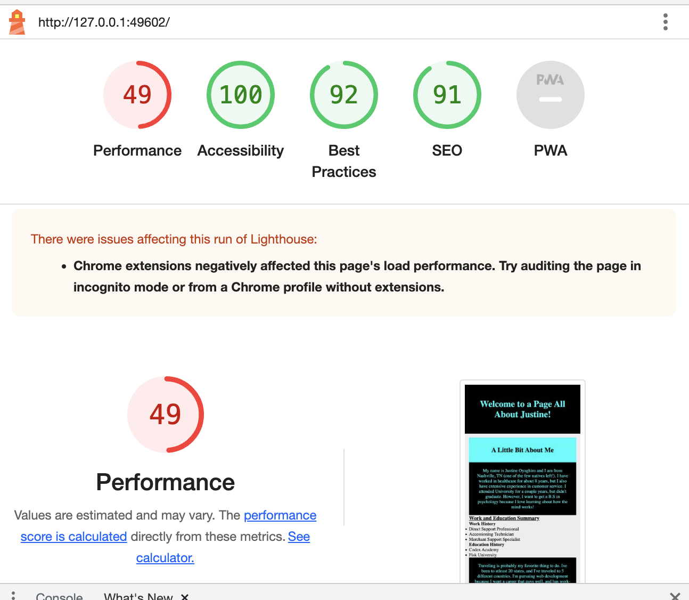
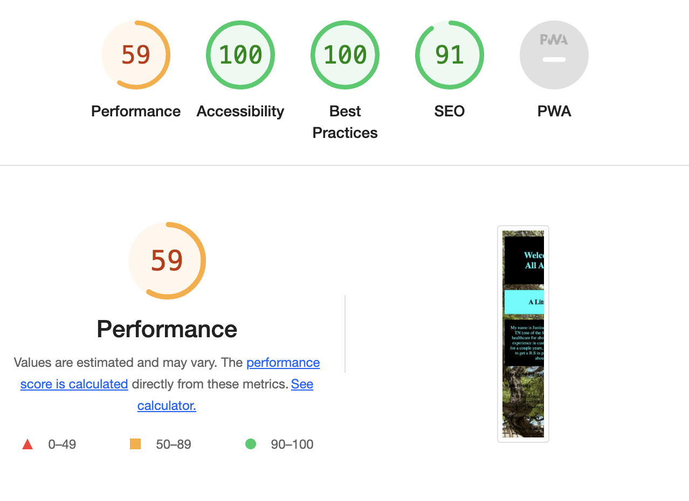

# Lab-02-05b
This lab has been continued through lab-05b
## About Me
This is a page about me. On this page, you will be given prompts to answer based off the information given. I have utilized mostly JavaScript, HTML and CSS to construct this page.
### Lab-02
In Lab-02, I started by making an HTML page with a biography including my work and education history. After my HTML was finished, I used Javascript to prompt the user with five yes or no questions and alerted them if their answer was correct ir incorrect.
### Lab-03
In Lab-03, I added an ordered and unordered list to my HTML. Also used Javascript to prompt user to guess a number.Utilized arrays to prompt a multiple answer question. Another loop was used to give users 6 attempts to answer a multiple choice prompt as well as feedback to see whether their answers were correct. I will attempt stretch goals at a later date.
### Lab-05b
Deployed site using github pages. Updated color pallete.

### Author: Justine Oyaghiro

### Links
https://unsplash.com/

### Lighthouse Score Lab-02

### Lighthouse Score Lab-03

